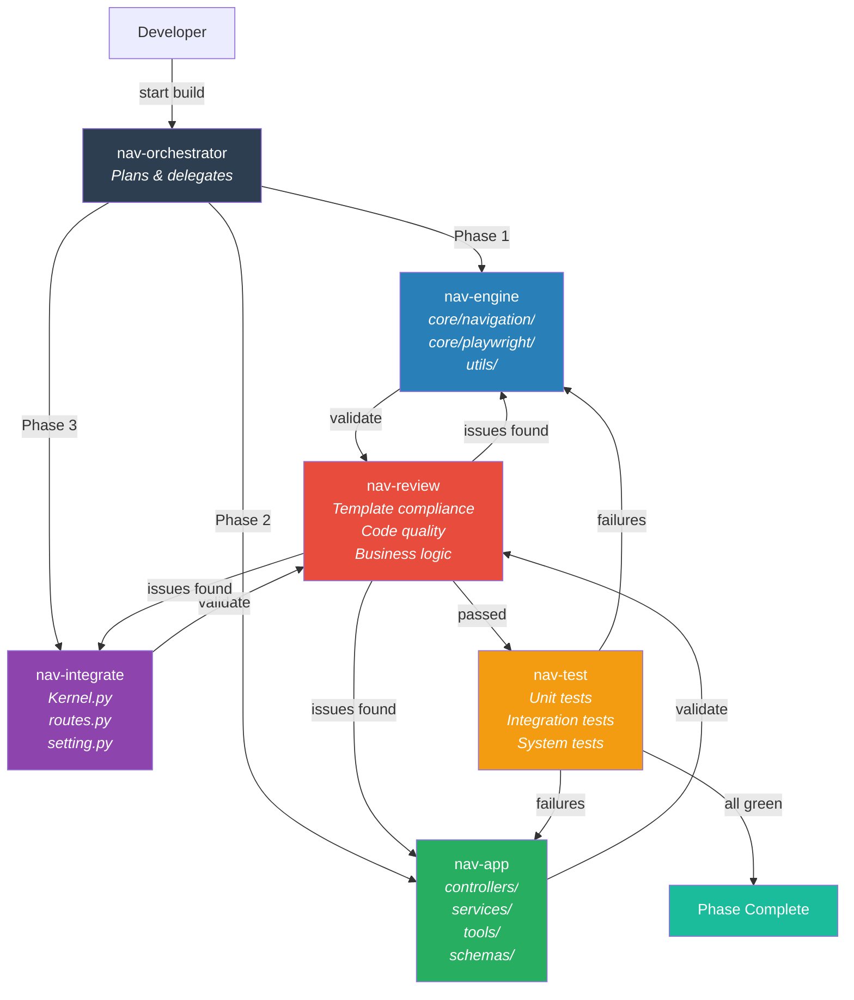
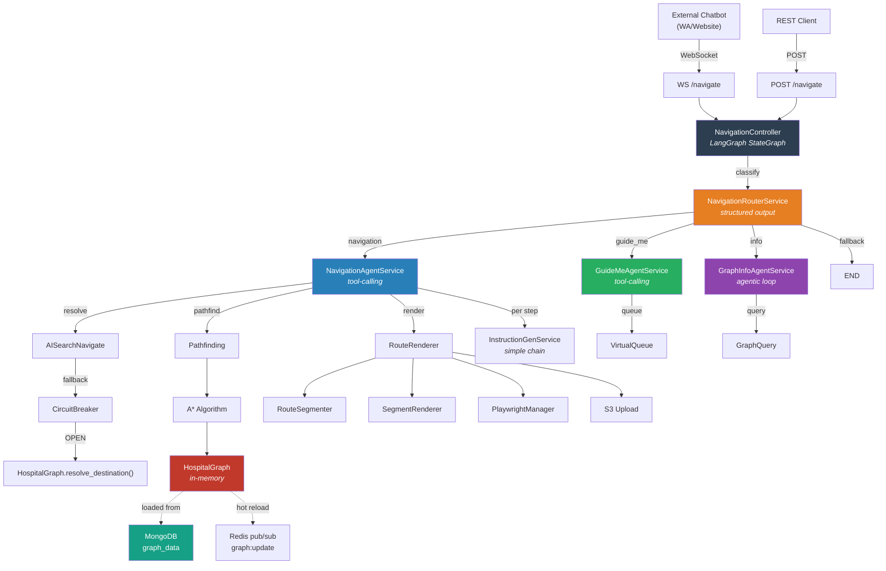
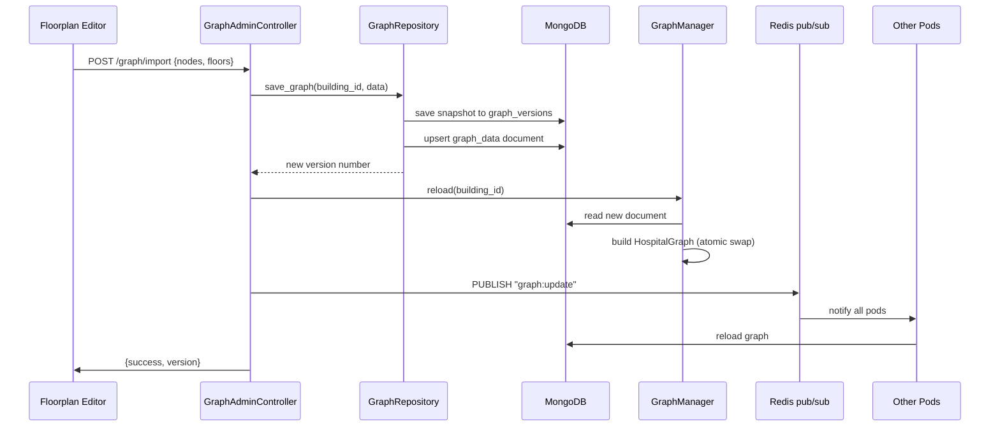
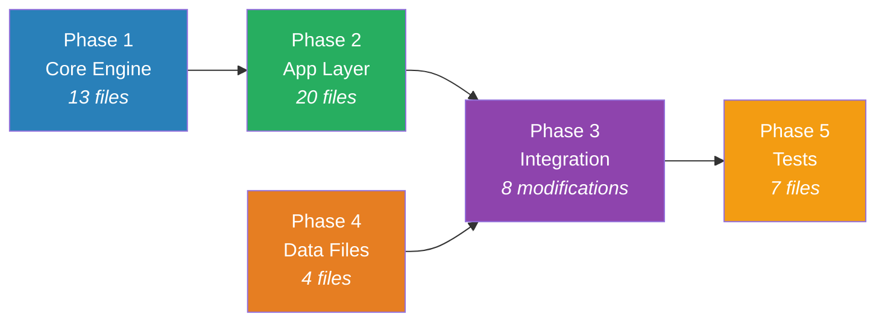

# Agent Architecture

## Build System Agents

## Navigation System Architecture (Runtime)

## Data Flow: Admin Import

## Phase Dependency Graph

## Agent Capabilities Matrix

| Agent | Model | Tools | Memory | Can Write Code | Can Review |
|-------|-------|-------|--------|---------------|------------|
| nav-orchestrator | opus | Read, Glob, Grep, Agent | project | No | No |
| nav-engine | opus | Read, Write, Edit, Bash, Agent | project | Yes | No |
| nav-app | opus | Read, Write, Edit, Bash, Agent | project | Yes | No |
| nav-integrate | opus | Read, Edit, Grep, Glob, Bash | project | Edit only | No |
| nav-review | opus | Read, Grep, Glob | project | No | Yes |
| nav-test | sonnet | Read, Write, Edit, Bash | project | Tests only | No |
